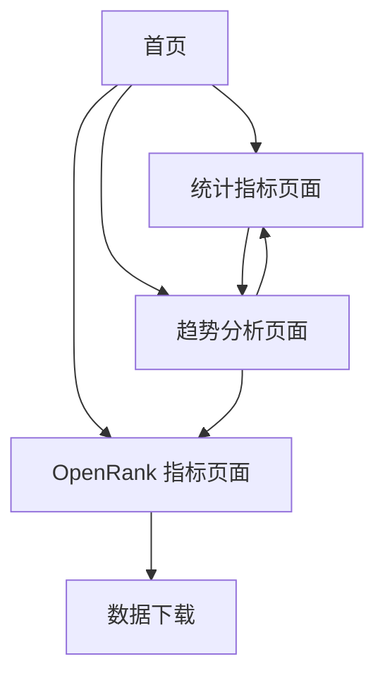

# KWDB OpenRank 指标展示网站产品需求文档

## 1. Product Overview

本项目旨在构建一个静态网站，专门用于展示 gitee/kwdb/kwdb 项目的 OpenRank 指标数据。网站将从 OpenDigger 的公开 API 获取实时数据，并通过可视化图表的形式展示项目的影响力指标、社区活跃度和发展趋势。

- 主要目的：为 KWDB 项目提供一个专业的指标展示平台，帮助开发者、用户和社区了解项目的发展状况和影响力。
- 目标用户：KWDB 项目的开发者、贡献者、用户以及对开源项目指标感兴趣的研究人员。
- 市场价值：提升项目透明度，增强社区信任度，为项目决策提供数据支持。

## 2. Core Features

### 2.1 User Roles

本网站为公开访问的静态网站，无需用户注册或登录，所有访问者均享有相同的浏览权限。

### 2.2 Feature Module

我们的 KWDB OpenRank 指标展示网站包含以下主要页面：

1. **首页**：项目概览、核心指标摘要、导航菜单
2. **OpenRank 指标页面**：全域 OpenRank 和社区 OpenRank 的详细展示
3. **统计指标页面**：项目活跃度、贡献者统计、问题和变更请求统计
4. **趋势分析页面**：历史数据趋势图表、时间序列分析

### 2.3 Page Details

| Page Name | Module Name | Feature description |
|-----------|-------------|---------------------|
| 首页 | 项目概览 | 展示 KWDB 项目基本信息、最新 OpenRank 数值、项目描述和关键统计数据 |
| 首页 | 核心指标摘要 | 显示当前月度、季度、年度的核心指标数值，包括全域 OpenRank 和社区 OpenRank |
| 首页 | 导航菜单 | 提供清晰的页面导航，快速访问各个功能模块 |
| OpenRank 指标页面 | 全域 OpenRank 展示 | 通过图表展示项目的全域 OpenRank 历史数据，支持月度、季度、年度视图切换 |
| OpenRank 指标页面 | 社区 OpenRank 展示 | 展示项目在特定社区内的 OpenRank 指标，包括数据可视化和趋势分析 |
| OpenRank 指标页面 | 数据下载 | 提供原始数据下载功能，支持 JSON 格式导出 |
| 统计指标页面 | 活跃度统计 | 展示项目的开发者活跃度、提交频率、问题处理效率等统计数据 |
| 统计指标页面 | 贡献者分析 | 显示贡献者数量变化、新增贡献者趋势、核心贡献者识别 |
| 统计指标页面 | 问题和 PR 统计 | 展示问题创建、解决情况，变更请求的提交和合并统计 |
| 趋势分析页面 | 历史趋势图表 | 提供交互式图表，展示各项指标的历史变化趋势 |
| 趋势分析页面 | 时间范围选择 | 支持用户自定义时间范围查看数据，包括最近 6 个月、1 年、全部历史等 |
| 趋势分析页面 | 对比分析 | 提供不同时间段的数据对比功能，帮助识别发展模式 |

## 3. Core Process

### 主要用户操作流程

用户访问网站后，首先进入首页查看项目概览和核心指标摘要。用户可以通过导航菜单访问不同的功能页面：

- 查看详细的 OpenRank 指标数据和可视化图表
- 浏览项目的统计指标，了解活跃度和贡献情况
- 在趋势分析页面进行深入的数据分析和历史对比
- 根据需要下载原始数据进行进一步分析

### 页面导航流程图

## 4. User Interface Design

### 4.1 Design Style

- **主色调**：深蓝色 (#1e3a8a) 和浅蓝色 (#3b82f6)，体现专业性和技术感
- **辅助色**：绿色 (#10b981) 用于正向指标，橙色 (#f59e0b) 用于警告，红色 (#ef4444) 用于负向指标
- **按钮样式**：圆角矩形按钮，具有悬停效果和阴影
- **字体**：主标题使用 24px-32px，正文使用 14px-16px，优先使用系统字体
- **布局风格**：卡片式布局，顶部导航栏，响应式设计
- **图标风格**：使用简洁的线性图标，支持数据可视化的图表图标

### 4.2 Page Design Overview

| Page Name | Module Name | UI Elements |
|-----------|-------------|-------------|
| 首页 | 项目概览 | 大标题、项目 logo、简介文字、关键数据卡片，使用白色背景和蓝色强调色 |
| 首页 | 核心指标摘要 | 数据卡片网格布局，每个卡片包含指标名称、数值和变化趋势图标 |
| 首页 | 导航菜单 | 水平导航栏，包含 logo、菜单项和搜索框，固定在页面顶部 |
| OpenRank 指标页面 | 图表展示区 | 大型图表容器，支持交互式操作，包含图例和数据标签 |
| OpenRank 指标页面 | 时间选择器 | 标签页式时间范围选择，支持月度、季度、年度切换 |
| 统计指标页面 | 统计卡片 | 多列网格布局，每个统计项使用独立卡片展示 |
| 趋势分析页面 | 交互式图表 | 全屏图表区域，支持缩放、平移和数据点悬停显示 |

### 4.3 Responsiveness

网站采用移动优先的响应式设计，确保在桌面、平板和手机设备上都能良好显示。针对触屏设备优化交互体验，图表支持触摸操作进行缩放和平移。