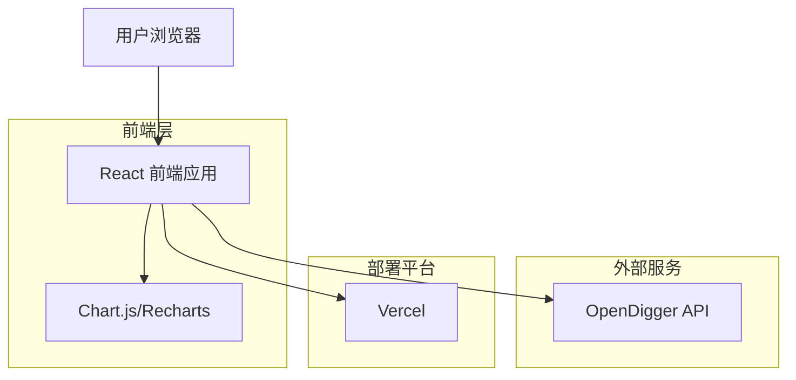
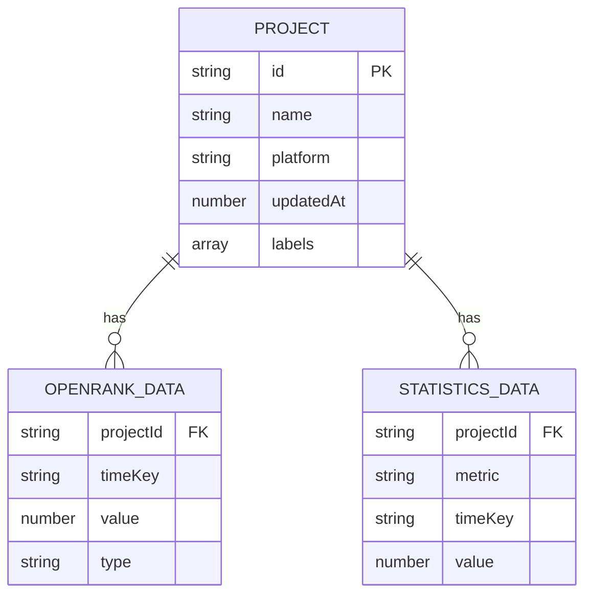

# KWDB OpenRank 指标展示网站技术架构文档

## 1. Architecture design



## 2. Technology Description

* **前端**: React\@18 + TypeScript + Tailwind CSS\@3 + Vite

* **图表库**: Recharts (React 图表库)

* **HTTP 客户端**: Axios

* **部署**: Vercel (静态网站托管)

* **数据源**: OpenDigger API (<https://oss.open-digger.cn/>)

## 3. Route definitions

| Route       | Purpose                           |
| ----------- | --------------------------------- |
| /           | 首页，展示项目概览和核心指标摘要                  |
| /openrank   | OpenRank 指标页面，展示全域和社区 OpenRank 数据 |
| /statistics | 统计指标页面，展示活跃度和贡献者统计                |
| /trends     | 趋势分析页面，提供历史数据分析和对比                |

## 4. API definitions

### 4.1 OpenDigger API 集成

**获取 KWDB 项目元数据**

```
GET https://oss.open-digger.cn/gitee/kwdb/kwdb/meta.json
```

Response:

| Param Name | Param Type | Description       |
| ---------- | ---------- | ----------------- |
| updatedAt  | number     | 数据更新时间戳           |
| type       | string     | 数据类型 (repo)       |
| id         | number     | 项目在 Gitee 中的唯一 ID |
| labels     | array      | 项目所属标签信息          |

**获取全域 OpenRank 数据**

```
GET https://oss.open-digger.cn/gitee/kwdb/kwdb/openrank.json
```

Response:

```json
{
  "2023": 45.67,
  "2024": 52.34,
  "2023-01": 3.45,
  "2023-02": 4.12,
  "2023Q1": 12.34,
  "2023Q2": 15.67
}
```

**获取社区 OpenRank 数据**

```
GET https://oss.open-digger.cn/gitee/kwdb/kwdb/community_openrank.json
```

**获取活跃度统计数据**

```
GET https://oss.open-digger.cn/gitee/kwdb/kwdb/activity.json
```

**获取开发者统计数据**

```
GET https://oss.open-digger.cn/gitee/kwdb/kwdb/participants.json
```

### 4.2 数据处理接口

**时间序列数据处理**

```typescript
interface TimeSeriesData {
  date: string;
  value: number;
  type: 'monthly' | 'quarterly' | 'yearly';
}

interface OpenRankData {
  [key: string]: number;
}

function processTimeSeriesData(data: OpenRankData): TimeSeriesData[] {
  // 处理 OpenDigger 返回的时间序列数据
}
```

**指标计算接口**

```typescript
interface MetricsSummary {
  currentValue: number;
  previousValue: number;
  changePercentage: number;
  trend: 'up' | 'down' | 'stable';
}

function calculateMetricsSummary(data: OpenRankData): MetricsSummary {
  // 计算指标摘要信息
}
```

## 5. Data model

### 5.1 Data model definition



### 5.2 TypeScript 类型定义

```typescript
// 项目元数据类型
interface ProjectMeta {
  updatedAt: number;
  type: 'repo';
  id: number;
  labels: {
    id: string;
    name: string;
    type: string;
  }[];
}

// OpenRank 数据类型
interface OpenRankData {
  [timeKey: string]: number;
}

// 统计数据类型
interface StatisticsData {
  [timeKey: string]: number;
}

// 图表数据类型
interface ChartDataPoint {
  date: string;
  value: number;
  label?: string;
}

// API 响应类型
interface ApiResponse<T> {
  data: T;
  status: 'success' | 'error';
  message?: string;
}

// 时间范围类型
type TimeRange = 'monthly' | 'quarterly' | 'yearly' | 'all';

// 指标类型
type MetricType = 'openrank' | 'community_openrank' | 'activity' | 'participants';
```

## 6. 部署和性能优化

### 6.1 构建配置

* 使用 Vite 进行快速构建和热重载开发

* 启用代码分割和懒加载优化包大小

* 配置 Tailwind CSS 的 purge 功能移除未使用的样式

### 6.2 缓存策略

* 利用 OpenDigger API 响应头中的 Expires 字段进行浏览器缓存

* 实现客户端数据缓存，避免重复请求相同数据

* 使用 Service Worker 进行离线缓存（可选）

### 6.3 错误处理

* 实现 API 请求失败的重试机制

* 提供数据加载失败时的友好错误提示

* 添加数据验证确保 API 返回数据的完整性

### 6.4 SEO 优化

* 配置适当的 meta 标签和 Open Graph 标签

* 实现结构化数据标记

* 优化页面加载速度和 Core Web Vitals 指标

